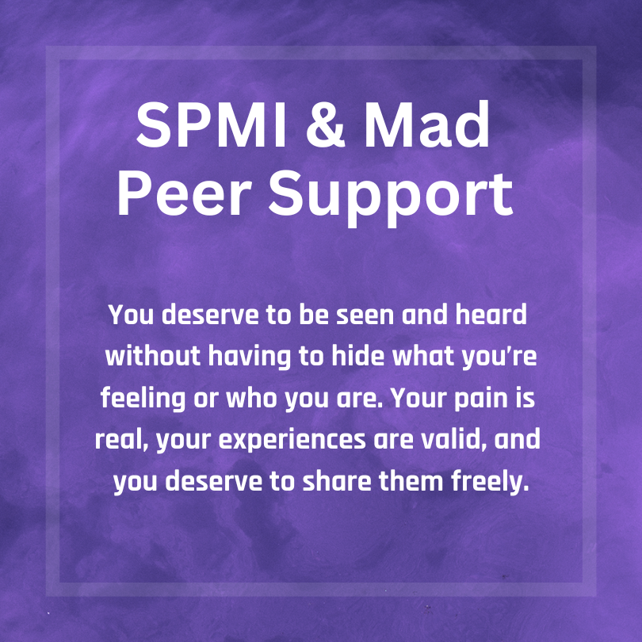

  

Damien was a 2023 - 2024 RECRUIT intern and psychology student who seeks to bring more Mad voices into the institutional spaces that so often speak about us without us. He is genderfluid, bisexual, and polyamorous. She also lives with bipolar disorder, Borderline Personality Disorder, C-PTSD, and has dissociative and psychotic experiences. It has ADHD, autism, and just as much right to live a life that brings it joy as anybody else.

 

In her RECRUIT Internship with THRIVE, Damien led peer support groups for folks with lived experience with Madness / SPMI's ("serious and persistent mental illness"), and wrote a series of articles and social media posts on stigma, Madness, and mental illness.

 

## Articles

* [What is Stigma?](https://drive.google.com/file/d/1H7VwC261ycMPdIiHggY81KgGg8VPt534/view?usp=sharing)
* [National Minority Mental Health Awareness Month](https://drive.google.com/file/d/1Y__bUhr05K9iLfKBxKljGgGR9MwCwOy8/view?usp=sharing)
* [Destigmatisation as an Individual](https://drive.google.com/file/d/1BNxqszW7O8Hd_Yu7XoaasjTiLDV85skB/view?usp=sharing)

 

## Social Media Posts

* [Recognizing Structural Stigma](https://www.instagram.com/p/C-7vZfIOdvB/?utm_source=ig_web_copy_link&igsh=MzRlODBiNWFlZA==)
* [A History of Madness: On Reclamation and Identity](https://www.instagram.com/p/C95LAUOuHJX/?utm_source=ig_web_copy_link&igsh=MzRlODBiNWFlZA==)
* [Coping with Self Stigma](https://www.instagram.com/p/C9LK083vS5U/?utm_source=ig_web_copy_link&igsh=MzRlODBiNWFlZA==)

 

 

 

