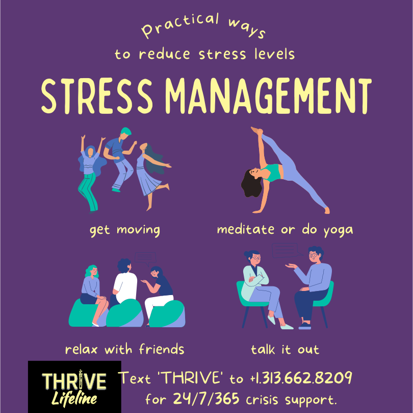

You are free to download these graphics and share them widely!

```{=html}
<!-- Add 1 row of 3 cards -->
<div class="container">
<div class="row">
		<div class="col-md-4">
		<div class="card h-100">
		  <div class="card-body">
			<div class="card-img">
			  
			</div>
			  <p class="card-title">THRIVE Brochure</p>
				<!-- <p class="card-text" style="font-style: italic;">ABC</p> -->
			</div>
			<div class="card-footer mx-auto">
			  <a download="lifeline-brochure.pdf" href="images/gallery/lifeline-brochure.pdf" class="button"><i class="fas fa-download" aria-hidden="true"></i> Download</a>
				<!-- <a href="https://thrivelifeline.org/images/gallery/lifeline-brochure.svg" class="button"><i class="fas fa-download" aria-hidden="true"></i> Download</a> -->
			</div>
			</div>
		  </div>
		  <div class="col-md-4">
			<div class="card h-100">
			  <div class="card-body">
				  <div class="card-img">
					  
					</div>
					  <p class="card-title">LGBTQ2S+ Flyer</p>
					</div>
					<div class="card-footer mx-auto">
					<a download="lgbtq-flyer.pdf" href="images/gallery/lgbtq-flyer.pdf" class="button"><i class="fas fa-download" aria-hidden="true"></i> Download</a>
					  <!-- <a href="https://thrivelifeline.org/images/gallery/be-gentle.svg" class="button"><i class="fas fa-download" aria-hidden="true"></i> Download</a> -->
					</div>
			</div>
			</div>
		  <div class="col-md-4">
			  <div class="card h-100">
			  <div class="card-body">
				  <div class="card-img">
					  
					</div>
					  <p class="card-title">Business Cards</p>
					</div>
					<div class="card-footer mx-auto">
					  <a download="business-cards.zip" href="images/gallery/business-cards.zip" class="button"><i class="fas fa-download" aria-hidden="true"></i> Download</a>
						<!-- <a href="https://thrivelifeline.org/images/gallery/beautiful.svg" class="button"><i class="fas fa-download" aria-hidden="true"></i> Download</a>  -->
					</div>
				</div>
		  	</div>
</div>
</div>
<!-- End Row 1 -->

<!-- Add 1 row of 3 cards -->
<div class="container">
<div class="row">
		<div class="col-md-4">
		<div class="card h-100">
		  <div class="card-body">
			<div class="card-img">
			  
			</div>
			  <p class="card-title">Living a Balanced Life</p>
				<!-- <p class="card-text" style="font-style: italic;">ABC</p> -->
			</div>
			<div class="card-footer mx-auto">
			  <a download="balanced-life.svg" href="images/gallery/balanced-life.svg" class="button"><i class="fas fa-download" aria-hidden="true"></i> Download</a>
				<!-- <a href="https://thrivelifeline.org/images/gallery/balanced-life.svg" class="button"><i class="fas fa-download" aria-hidden="true"></i> Download</a> -->
			</div>
			</div>
		  </div>
		  <div class="col-md-4">
			<div class="card h-100">
			  <div class="card-body">
				  <div class="card-img">
					  
					</div>
					  <p class="card-title">Be Gentle with Yourself</p>
					</div>
					<div class="card-footer mx-auto">
					<a download="be-gentle.svg" href="images/gallery/be-gentle.svg" class="button"><i class="fas fa-download" aria-hidden="true"></i> Download</a>
					  <!-- <a href="https://thrivelifeline.org/images/gallery/be-gentle.svg" class="button"><i class="fas fa-download" aria-hidden="true"></i> Download</a> -->
					</div>
			</div>
			</div>
		  <div class="col-md-4">
			  <div class="card h-100">
			  <div class="card-body">
				  <div class="card-img">
					  
					</div>
					  <p class="card-title">You're Beautiful</p>
					</div>
					<div class="card-footer mx-auto">
					  <a download="beautiful.svg" href="images/gallery/beautiful.svg" class="button"><i class="fas fa-download" aria-hidden="true"></i> Download</a>
						<!-- <a href="https://thrivelifeline.org/images/gallery/beautiful.svg" class="button"><i class="fas fa-download" aria-hidden="true"></i> Download</a>  -->
					</div>
				</div>
		  	</div>
</div>
</div>
<!-- End Row 1 -->

<!-- Add 1 row of 3 cards -->
<div class="container">
<div class="row">
		<div class="col-md-4">
		<div class="card h-100">
		  <div class="card-body">
			<div class="card-img">
			  
			</div>
			  <p class="card-title">You Are Enough</p>
			</div>
			<div class="card-footer mx-auto">
			  <a download="experience.svg" href="images/gallery/experience.svg" class="button"><i class="fas fa-download" aria-hidden="true"></i> Download</a>
				<!-- <a href="https://thrivelifeline.org/images/gallery/experience.svg" class="button"><i class="fas fa-download" aria-hidden="true"></i> Download</a> -->
			</div>
			</div>
		  </div>
		  <div class="col-md-4">
			<div class="card h-100">
			  <div class="card-body">
				  <div class="card-img">
					  
					</div>
					  <p class="card-title">Give What You Give</p>
					</div>
					<div class="card-footer mx-auto">
					  <a download="give.svg" href="images/gallery/give.svg" class="button"><i class="fas fa-download" aria-hidden="true"></i> Download</a>
					  <!-- <a href="https://thrivelifeline.org/images/gallery/give.svg" class="button"><i class="fas fa-download" aria-hidden="true"></i> Download</a> --> 
					</div>
			</div>
			</div>
		  <div class="col-md-4">
			  <div class="card h-100">
			  <div class="card-body">
				  <div class="card-img">
					  
					</div>
					  <p class="card-title">It's Okay</p>
					</div>
					<div class="card-footer mx-auto">
					  <a download="okay.svg" href="images/gallery/okay.svg" class="button"><i class="fas fa-download" aria-hidden="true"></i> Download</a>
						<!-- <a href="https://thrivelifeline.org/images/gallery/okay.svg" class="button"><i class="fas fa-download" aria-hidden="true"></i> Download</a> -->
					</div>
				</div>
		  	</div>
</div>
</div>
<!-- End Row 2 -->

<!-- Add 1 row of 3 cards -->
<div class="container">
<div class="row">
		<div class="col-md-4">
		<div class="card h-100">
		  <div class="card-body">
			<div class="card-img">
			  
			</div>
			  <p class="card-title">Self-Care</p>
			</div>
			<div class="card-footer mx-auto">
			  <a download="self-care.svg" href="images/gallery/self-care.svg" class="button"><i class="fas fa-download" aria-hidden="true"></i> Download</a>
				<!-- <a href="https://thrivelifeline.org/images/gallery/self-care.svg" class="button"><i class="fas fa-download" aria-hidden="true"></i> Download</a> -->
			</div>
			</div>
		  </div>
		  <div class="col-md-4">
			<div class="card h-100">
			  <div class="card-body">
				  <div class="card-img">
					  
					</div>
					  <p class="card-title">Stress Management</p>
					</div>
					<div class="card-footer mx-auto">
					  <a download="stress-management.svg" href="images/gallery/stress-management.svg" class="button"><i class="fas fa-download" aria-hidden="true"></i> Download</a>
					  <!-- <a href="https://thrivelifeline.org/images/gallery/stress-management.svg" class="button"><i class="fas fa-download" aria-hidden="true"></i> Download</a> -->
					</div>
			</div>
			</div>
		  <div class="col-md-4">
			  <div class="card h-100">
			  <div class="card-body">
				  <div class="card-img">
					  
					</div>
					  <p class="card-title">I am Worthy</p>
					</div>
					<div class="card-footer mx-auto">
					  <a download="worthy.svg" href="images/gallery/worthy.svg" class="button"><i class="fas fa-download" aria-hidden="true"></i> Download</a>
						<!-- <a href="https://thrivelifeline.org/images/gallery/worthy.svg" class="button"><i class="fas fa-download" aria-hidden="true"></i> Download</a> -->
					</div>
				</div>
		  	</div>
</div>
</div>
<!-- End Row 3 -->
```
