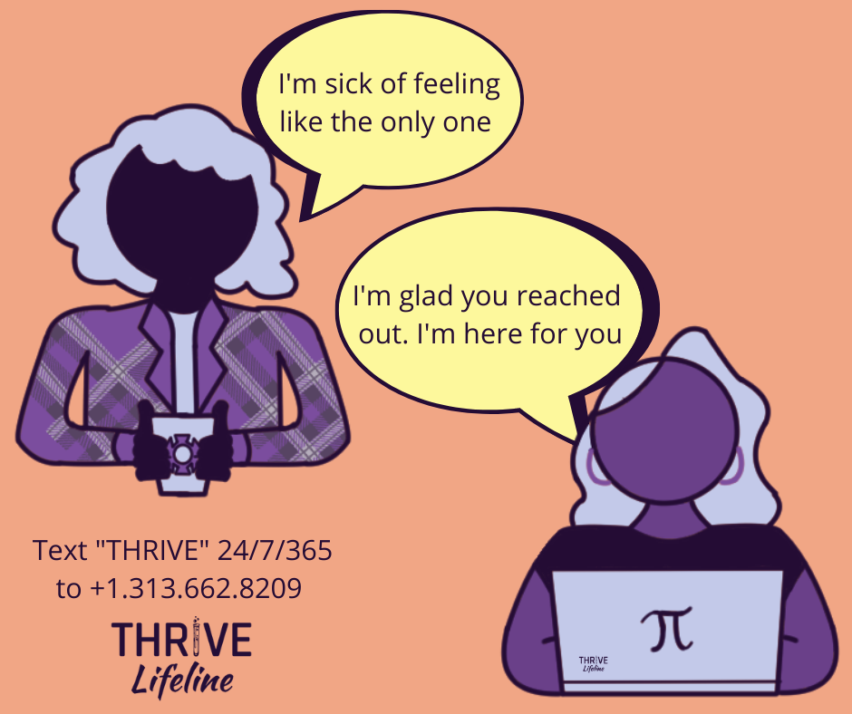
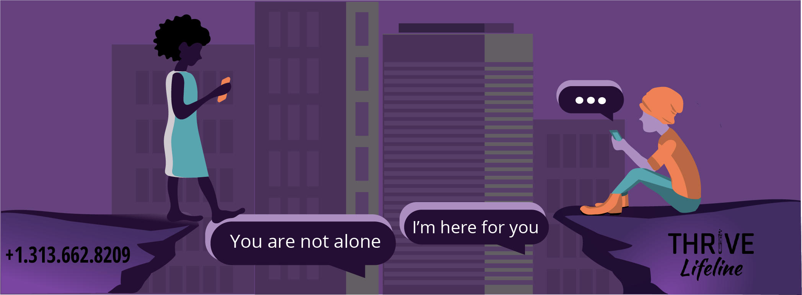
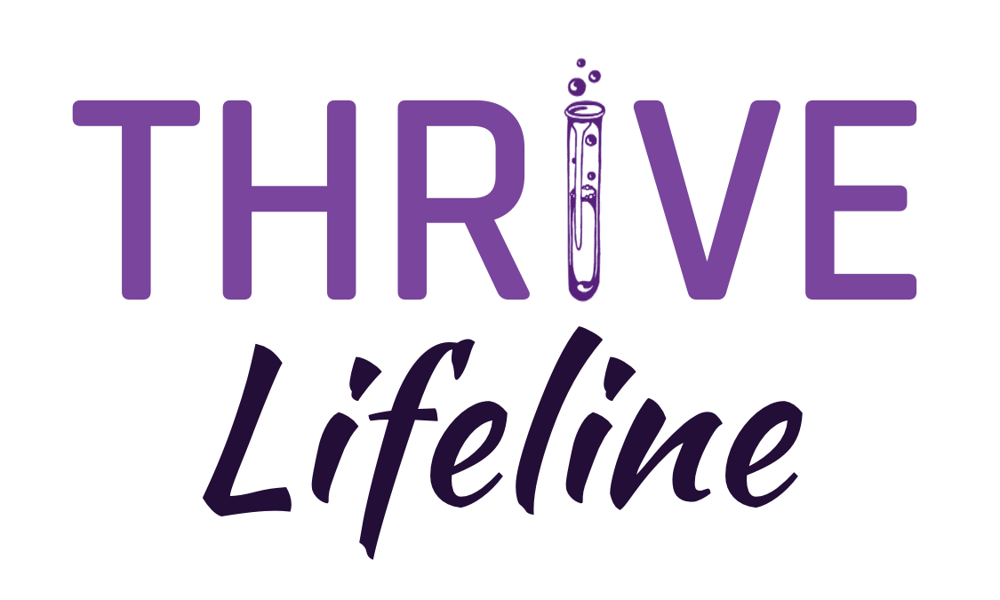

## Overview

<!--  -->

If you’re experiencing a mental health crisis and need to chat with a qualified
crisis responder, we are here for you.

If you are an underrepresented individual (person of color, LGBTQ2S+, person
living with disabilities, neurodiverse, and/or other marginalized identities), 
and experiencing obstacles because of (or simply have questions about) your
identities, we want to help you navigate those.

 

Please text "THRIVE" to begin your conversation with us 24/7/365, from anywhere:
<a href="sms:+13136628209&body=THRIVE">+1.313.662.8209</a>

 

We are experienced suicide interveners who will help keep you safe during times
of acute mental health crises. If you are not in an acute crisis, but are
dealing with stress as you navigate identity, orientation, or barriers to
academic and professional entry, we can help! We are here to support your
whole-self and we’re happy to help you during these troubling times.

THRIVE Lifeline offers 24/7/365 judgment-free, confidential text messaging to
individuals aged 18+.

  

Together, we THRIVE.

  

## Contact THRIVE Lifeline

In crisis? Text: <a href="sms:+13136628209&body=THRIVE">+1.313.662.8209</a>

For non-crisis related email inquiries: <info@thrivelifeline.org>

TRANS Support Groups: Held quarterly. Free wellness gift for the first 50 
attendees. Register today: <https://thriv.life/trans> 

 

## Supporting Us

Your contributions help THRIVE Lifeline to continue providing life-saving
and life-affirming crisis hotline support to marginalized individuals in STEMM.
Please consider making a tax deductible donation today:
<ul>
<li><a href=https://www.facebook.com/THRIVELifeline><b>
Facebook</b></a>
<li><a href=https://www.paypal.com/donate?hosted_button_id=CU5D6Q727QH5S><b>
Paypal</b></a> (@THRIVELifeline)
<li><a href=https://venmo.com/code?user_id=3676112202761290213><b>
Venmo</b></a> (@THRIVELifeline)
<li><b>Check:</b> <u>Make out to:</u> THRIVE Inc.  <u>Mail to:</u> 2114 N. Flamingo Rd. Box #5018; Pembroke Pines, FL 33028
</ul>

You can also share our 
[business cards](images/Signs_Business_Cards.pdf)
or talk to your schools and organizations about 
[becoming a partner](partners.html).
