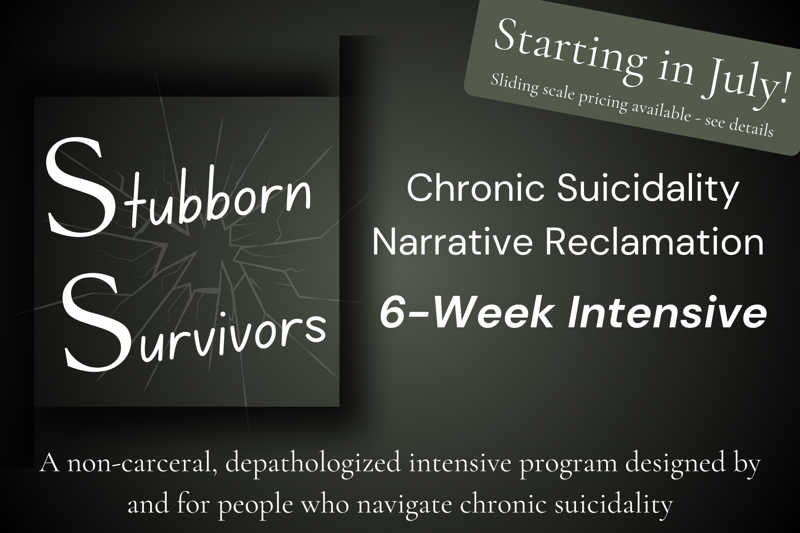
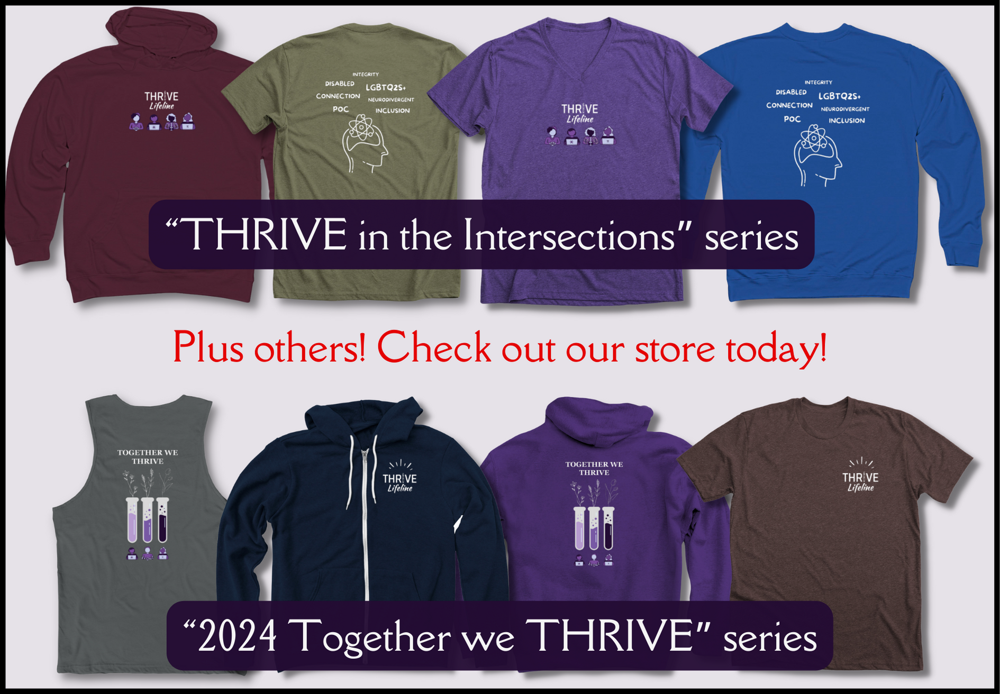

## Overview

<!--  -->

If you’re experiencing a mental health crisis and need to chat with a qualified
crisis responder, we are here for you.

If you are an underrepresented individual (person of color, LGBTQ2S+, person
living with disabilities, neurodivergent, and/or other marginalized identities), 
and experiencing obstacles because of (or simply have questions about) your
identities, we want to help you navigate those.

<a href="https://thrivelifeline.org/images/privacy.pdf" class="btn btn-primary btn-lg" role="button">Read our Privacy Policy</a>

 

Please text "THRIVE" to begin your conversation with us 24/7/365, from anywhere:
<a href="sms:+13136628209&body=THRIVE">+1.313.662.8209</a>

 

<b><big>Our lifeline is temporarily down and raising funds. To help us pay for the more robust communications system that we need to restore our service, donate or share our fundraiser:
</big>

<a href="https://www.zeffy.com/en-US/peer-to-peer/help-thrive-lifeline-thrive" class="btn btn-primary btn-lg" role="button">Help Us Fundraise</a>

If you need support in the meantime, we have numerous free and low cost support options available in partnership with Stronger U:

- Peer support discord servers: [Stronger Together](https://strongeruwellness.com/services/stronger-together/) and [TRANS](https://thrivelifeline.org/trans-discord)
- Donation-based peer support groups, no one turned away for lack of funds: [Find calendar here](https://strongeruwellness.com/services/stronger-together/)
- [Free coping skill guides](https://strongeruwellness.com/free-resources/free-coping-tools/)

You can also refer to the list of non-carceral support options below.
</b>

 

We are experienced suicide interveners who will help keep you safe during times
of acute mental health crises. If you are not in an acute crisis, but are
dealing with stress as you navigate identity, orientation, or barriers to
academic and professional entry, we can help! We are here to support your
whole-self and we’re happy to help you during these troubling times.

THRIVE Lifeline offers 24/7/365 judgment-free, confidential text messaging to
individuals aged 18+.

[Click here for a list of other non-carceral support options in addition to THRIVE Lifeline](https://drive.google.com/file/d/1C3RJpE2o2W5cKM78pdCigVXQEMGMC1hz/view?usp=drive_link)

  

Together, we THRIVE.

  

## Chronic Suicidality Narrative Reclamation 6-Week Intensive 

An intensive program for suicidality that isn’t carceral?? Correct! This is an intimate cohort-based program with daily mixes of group coaching, personalized and community care, and synchronous and asynchronous coaching elements. Participants will gain insight, support, and step-by-step tools that help you to reclaim your suicide narrative in ways that are meaningful to you!

No more losing your agency when you disclose suicidality to someone who isn’t safe, being pathologized, facing increased trauma when you needed care, not being believed, having to prove yourself, or feeling trapped. We've partnered with Stronger U on this program for YOU. We want to help you reclaim your narrative because it matters. You matter.

[Click here to register for the 6-week program](https://form.jotform.com/251036811552147). Or, [learn more here](https://strongeruwellness.com/6-week-intensive/). If you're curious about other offerings, [click here to see our additional partnered events with Stronger U.](https://strongeruwellness.com/events-calendar/)!

 

## Merchandise Store

Check out these new shirt designs and other merchandise in our [Bonfire store](https://www.bonfire.com/store/thrive-lifeline/)! We have a variety of different designs on shirts, mugs, and notebooks.

We'd also love to see your own shirt ideas! What affirms you? What message do you want to share with your community? Design a graphic, and [click here](https://www.bonfire.com/org/thriving-harnesses-respect-inclusion-and-vested-empathy-inc-854273212/) to start your own fundraiser!

 

## Contact THRIVE Lifeline

In crisis? Text: <a href="sms:+13136628209&body=THRIVE">+1.313.662.8209</a>

For non-crisis related email inquiries: <info@thrivelifeline.org>

 

## Shareable Flyers

Help us keep our communities alive and thriving! Share THRIVE Lifeline flyers with people, schools, organizations, or other community spaces.

 - [LGBTQ2S+ flyer](https://drive.google.com/file/d/1HtgCYWuMyS0oc3NLeHdeCmvDdPP3K9zG/view?usp=drive_link) for anyone within the LGBTQ2S+ community
 - [STEMM flyer](https://drive.google.com/file/d/15SeBeD6MrcQbzG1d56_vwXsCWhMHJ7bl/view?usp=sharing) for marginalized individuals within STEMM fields (science, technology, enginnering, math, and medicine)
 - [Non-carceral flyer](https://drive.google.com/file/d/1eqAYEQSwozjcEcPtCULJsa8RfkuiCCEl/view?usp=sharing) for marginalized individuals looking for a safe space to talk about suicide

 

## Supporting Us

See our [volunteer opportunities](https://www.thrivelifeline.org/volunteer.html) for some big and small ways you can get involved and help us THRIVE!

Want to stay up to date with what THRIVE is up to? [Subscribe to our monthly newsletter today!](https://mailchi.mp/71ebc44f2d34/together-we-thrive)

Purchasing [Stronger U services](https://strongeruwellness.com/services/) helps fund THRIVE Lifeline and professional development opportunities for our community members through our revenue sharing model!

Make a tax deductible donation! Your contributions help THRIVE Lifeline to continue providing life-saving and life-affirming crisis hotline support to multiply marginalized individuals.
<ul>
<li><a href=https://www.facebook.com/THRIVELifeline><b>
Facebook</b></a>
<li><a href=https://www.paypal.com/donate?hosted_button_id=CU5D6Q727QH5S><b>
Paypal</b></a> (@THRIVELifeline)
<li><a href=https://venmo.com/code?user_id=3676112202761290213><b>
Venmo</b></a> (@THRIVELifeline)
<li><b>Check:</b> <u>Make out to:</u> THRIVE Inc.  <u>Mail to:</u> 2114 N. Flamingo Rd. Box #5018; Pembroke Pines, FL 33028
</ul>

 

View our latest press release [here](https://thrivelifeline.org/recruit_grant.html).
