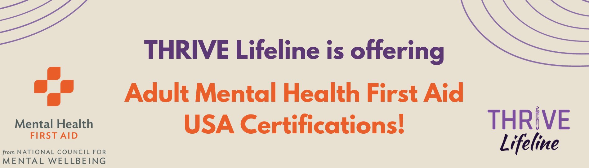

<!-- <i class="fas fa-hard-hat fa-3x" aria-hidden="true"></i> Under Construction! <i class="fas fa-hard-hat fa-3x" aria-hidden="true"></i> -->

 

[Get your spot in the August 31 training! Click here to sign up.](https://thriv.life/mhfa_signup)

<!--Check back soon for the next training date!-->

<a href="https://thriv.life/mhfa_signup" class="btn btn-primary btn-lg" role="button">Sign Up</a>

 

## Overview of MHFA

[Mental Health First Aid USA](https://www.mentalhealthfirstaid.org/) (MHFA) is an evidence-based training that teaches participants how to identify, understand and respond to someone who is experiencing a mental health or substance-use challenge

Similar to physical First Aid and CPR, MHFA teaches a 5-step action plan for assisting someone experiencing a mental health or substance use crisis until professional assistance is obtained or the crisis is resolved. MHFA also teaches how to support someone showing warning signs of a mental health or substance use challenge.

This course requires 2 hours of self-paced content followed by 6 hours of instructor-led virtual training. It is valued at $170. No prior experience with mental health conversations or support is needed; the MHFA curriculum is designed to be accessible to anyone.

Sign up to learn how to support others experiencing mental health or substance use challenges, and prove your skills through a nationally accredited certification!

 

## MHFA Training Dates

August 31

  - Time: 12p - 6p ET  |  9a - 3p PT  |  6a - 12p HT
  - Location: Zoom (virtual)
  - Sign up here: [https://thriv.life/mhfa_signup](https://thriv.life/mhfa_signup)
  
   

## Sliding scale cost:

THRIVE has discounted the full rate of MHFA tickets to \$95 to support those in our community who need a globally recognized certification. \$95 is the cost for THRIVE to cover our expenses for this workshop. If you agree to pay the recommended price of \$170, then you are supporting the scholarship for another trainee who could not afford to pay our aid rate of \$75*. For every sponsor cost ticket that is purchased, THRIVE will cover the additional expense of the aid cost ticket. We believe that Together We THRIVE: we support each other with wealth, through acts of service, and through community connections, according to whatever we have to give.

*Please Note: If you need a scholarship to attend, email us at: <info@thrivelifeline.org>. We will reach out to our waiting list when scholarships become available.

<b>Ticket options:</b>

  - $170: Sponsor cost. Covers THRIVE's cost for hosting the workshop plus sponsors an aid cost ticket for someone who cannot pay
  - $110: Redistribution cost. Covers THRIVE's cost for hosting the workshop plus adds to the fund for another student.
  - $95: At cost. This ticket covers THRIVE's expenses for this workshop.
  - $75: Aid cost

   

## Refunds

Refunds will not be made under any circumstances. If you become unable to attend the training you register for, you may re-enroll in a later course offering. You must complete your training within 120 days of submitting this form.

 

## Access Info

  - The instructor-led portion of the training will be done in Zoom, with closed captions available. Prior to the course, you will be given access to the Participant Processing Guide, which follows the content of the course, includes key points, and provides space for you to write notes for yourself.
  - There will be three 10-minute breaks throughout the 6 hour course. You are encouraged to move, eat, hydrate, etc. as needed throughout the course and may choose to have your camera on or off. 
  - Participation is required, either through the chat or verbally.
  - If you have any questions or access needs that you wish to discuss with the instructors, please email <ash.parker@thrivelifeline.org> and <kj.hill@thrivelifeline.org>

 

[Sign up for the next Mental Health First Aid training!](https://thriv.life/mhfa_signup)

Any questions? Email the instructors, Ash Parker at <ash.parker@thrivelifeline.org> and KJ Hill at <kj.hill@thrivelifeline.org>.
