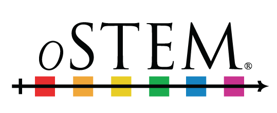
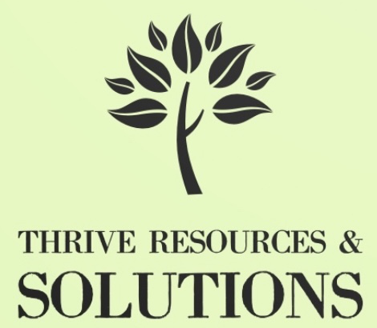
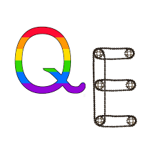

THRIVE Lifeline is a growing initiative seeking partnership with organizations 
like yours who share our passion for uplifting underrepresented people in STEMM. 
When your stakeholders reach out to us, they talk to someone who 'gets it'. 
Our qualified suicide interventionists provide judgment-free confidential 
support from academics who share marginalized identities and backgrounds.

Your partnership with THRIVE provides:

- Ongoing free access to life-saving, life-affirming support from responders 
who share their identities and experiences
- Connection of your stakeholders to existing resources within your greater 
organization
- Cross promotion on our website and social media platforms
- Quarterly data reports when 30 or more crisis conversations are initiated 
with your specific keyword in a 3-month period.

## Our Partners

We are pleased to announce our partnership with 
[Out in Science, Technology, Engineering, and Mathematics (oSTEM)](https://ostem.org/)!

Our second partner is [THRIVE Resources and Solutions](https://thriversolutions.org/)!

Our third partner is [Queer Engineer](https://www.queerengineer.org/)!

 

Interested in becoming a partner?

Please reach out to our Outreach Coordinator,
<a href="mailto:Emmett.Leddin@thrivelifeline.org">Emmett Leddin</a>.
