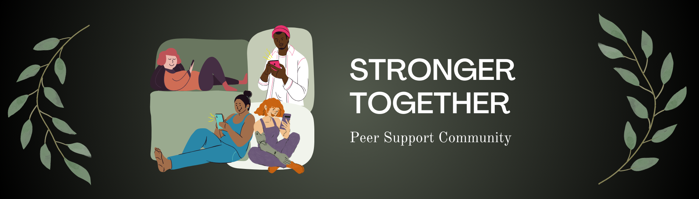

<!-- <i class="fas fa-hard-hat fa-3x" aria-hidden="true"></i> Under Construction! <i class="fas fa-hard-hat fa-3x" aria-hidden="true"></i> -->

 

The Stronger Together discord server is co-hosted by THRIVE and our partners at [Stronger U](https://strongeruwellness.com/services/stronger-together/), and centers multiply marginalized complex trauma survivors inside of a non-carceral, depathologized space (open to all 18+). Many of us did not have the community support we needed in vulnerable periods of our lives, and have found that being connected to a community who cares is one of the keys to helping each other to survive and thrive.

 

We also hold semi-frequent peer support voice chats in the discord that provide another way to connect and be held in community. Currently, we are holding the following peer support chats:

 * Trauma and Chronic Suicidality: on the second Friday of each month at 5pm GMT / 1pm ET / 10am PT
 * Trauma and DID / Plurality: on the fourth Monday of each month at midnight GMT / 8pm ET / 5pm PT
 * SPMI / Mad:
     + Friday, August 30 at 8p GMT / 4p ET / 1p PT

 

Unsure how to use discord? That’s okay! [This guide](https://drive.google.com/file/d/1sI6zQLuB49thisNzFfuL9a6EMb9CxoEm/view) has some information about our specific server layout, and you can also find some information about how to [download](https://support.discord.com/hc/en-us/articles/360033931551-Getting-Started) discord, understand what a [discord server](https://support.discord.com/hc/en-us/articles/360034842871-How-do-I-join-a-Server) is, and learn how to [send messages](https://support.discord.com/hc/en-us/articles/360034632292-Sending-Messages) so you can interact with our community. Feel free to ask questions in the server, too — we’re happy to help you figure out how to navigate it, and be appropriate and supportive in our shared community space!

 

[Join our discord server here today](https://discord.gg/tGWKTX6uka)

 

 

**Peer Support Calendar: All times are given in the Eastern Time Zone (New York).**

<!--<iframe src="https://calendar.google.com/calendar/embed?src=c_322a10beea4cbd7b0b198066f28624b22fbd23e019e3e75de8428b56257b4817%40group.calendar.google.com&ctz=America%2FNew_York&amp;src=Y192bGRlM285YzVidDU4a2gwM2tuMmI3Y240Y0Bncm91cC5jYWxlbmRhci5nb29nbGUuY29t&amp;color=%23009688&amp;showCalendars=1&amp;showTabs=1&amp;showTitle=1" style="border:solid 1px #777" width="800" height="600" frameborder="0" scrolling="no"></iframe>-->

<iframe src="https://calendar.google.com/calendar/embed?src=c_322a10beea4cbd7b0b198066f28624b22fbd23e019e3e75de8428b56257b4817%40group.calendar.google.com&ctz=America%2FNew_York&amp;color=%23009688&amp;showCalendars=1&amp;showTabs=1&amp;showTitle=1" style="border:solid 1px #777" width="800" height="600" frameborder="0" scrolling="no"></iframe>

