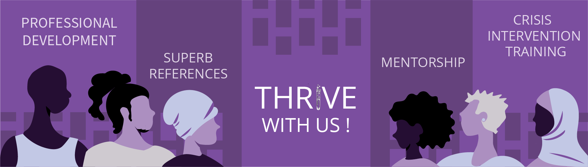

<!-- <i class="fas fa-hard-hat fa-3x" aria-hidden="true"></i> Under Construction! <i class="fas fa-hard-hat fa-3x" aria-hidden="true"></i> -->

 

THRIVE’s RECRUIT Internship program centers undergraduate students whose identities are multiply marginalized.

\* We dream of building a team that is representative of the breadth of our communities. We encourage applications from underrepresented LGBTQ2S+ persons of color, persons living with disabilities, Two Spirit, trans-femme and/or femme nonbinary individuals, and/or veterans. Additionally, we pride ourselves in working with people who struggle to gain traditional internships, whether that be because you are in a rural area, do not have transportation, are unable to find affirming support for your identity, working multiple jobs, caregiving, or any other barriers you might have faced. THRIVE’s team is majority POC and LGBTQ2S+ and we deeply value increasing representation.

Thanks to a grant from Dow through the company's All <i>IN</i> ERG fund\*, we are excited to announce <b>5 paid internship positions</b>\** for a 12 month internship that will run <u>August 20, 2023 - August 17, 2024</u>. Applications for these positions will close on <b>May 26, 2023</b> and we will retain a waitlist as candidates are chosen. 

\*Dow's ALL <i>IN</i> ERG Fund is a grant program that empowers the Company's Employee Resource Groups to address local community diversity, inclusion, and equity needs.

\**Please note that while funding is limited to 5 paid positions, space may open for volunteer-based internships (180 hours rather than 300) as our resources allow. We welcome your continued interest if volunteering is an option for you and we will continue to communicate when space becomes available. Please email  <info@thrivelifeline.org> to be added to the waitlist.

Click here to read the [full job description.](https://drive.google.com/file/d/1T2Tq69tXAEdbeTSXDyjJo9RY2wyUYQD-/view?usp=share_link)

[Click here to apply.](https://www.jotform.com/build/230412954932152)

 

## Welcome

You may be envisioning professional skill development in psychology, sociology, social work, pre-medicine, public health, or any number of human-serving disciplines, and seeking an internship or practicum that will

1. Meet you where you are as a student who experiences marginalization
2. Empower you and give you undeniable professional experience
3. Equip you with the skills to directly impact the lives of others who may share your intersecting identities and experiences.

The RECRUIT internship program is a 100% remote position, designed by and for people with multiply marginalized identities and as such reduces the number of work hours per week, expanding the program throughout a one-year period in order to maximize your customized development and to allow RECRUITS much needed time to be students, work another job, caregive for your families, or whatever your life requires. Our goal is to meet you where you are right now and help you reach your dreams. 

<i>Please note:</i> our grant covers stipended positions for undergraduate students residing in and eligible to work within the U.S. If you are a student residing outside the U.S., please contact us at  <info@thrivelifeline.org> for volunteer training opportunities.

 

## Program

Our internship program is designed to offer a combined approximately 300 hours (12 months) of crisis intervention training, professional and leadership development, regular connection with a mentor, and supervised crisis response on THRIVE Lifeline. Our training is centered in Whole-Human, empathetic support, cross-identity affirmation, trauma-informed care, and skillful deescalation. When you are onboarded, you will be paired with a mentor who will work directly with you throughout training and as you begin shifts on THRIVE Lifeline.

*Please let us know if your degree program has specific requirements for*
*your mentor.*

On average, RECRUITs in this program can expect to be trained and apply their skills in approximately 6 hours per week for about 50 weeks. The general breakdown of the 2023 - 2024 program is explained in the sections below:

 

### Training

70 hours of training will include:

- Professional and Interpersonal Skills
- Navigating triggering and unfamiliar topics 
- Common pitfalls in our language or responses 
- Conducting consensual and affirming risk assessments
- Being alert to signs of distress or escalation
- Affirming identity first; recognizing identities you share versus those you do not
- Awareness of individual and community trauma and its impact
- Recognizing your own trauma and building a self care routine that allows you to prioritize a texter’s needs
- Safe deescalation techniques
- Trauma-informed and accessible grounding techniques
- Affirming referrals and / or resources 
- Experiential Learning 
- Reading a variety of scenarios and learning a variety of response perspectives
- Practicing a minimum of 10 text-based scenarios where you will actively respond to a practice texter in crisis
- Professional development specific to navigating marginalized identities and experiences in the workplace
- Leadership and mentorship development
- Community outreach and education development

 

### Crisis Response

150 hours of crisis response skills practice:

Once you have completed training, you will transition to being a Crisis Responder on THRIVE Lifeline. On-call shifts are 3 hours each, and RECRUITs complete 1-2 shifts per week ([please view the program timeline here](https://drive.google.com/file/d/1rD11wPJcQ6g2RDH9RdVNrD6JW9-ZrWdJ/view?usp=share_link)). *Please note that RECRUITs will be required to take shift times during our peak hours between 6p - 6a Eastern, any day of the week. You will work with our Internship Coordinator to determine the days that work best for you within these hours.

 

### Professional development

50 hours of professional skills practice:

As a RECRUIT, you will be given the opportunity to work with mentors to build your resume and elevator pitch and to attend various panels. RECRUITs will also be leading community outreach and education in a variety of ways.

 

### Leadership development

30 hours of leadership skills practice:

As growing leaders, you will mentor new trainees or facilitate THRIVE sessions. We will work with you to help you gain confidence and improve the skills that will help you to be a leader in your own communities. 

 

## What we need from you
Interested RECRUITs should: 

  - Be undergraduate students
  
    - *Our grant covers current undergraduate students. If you are not a current undergraduate student, we invite you to take part in our volunteer-based (180 hour) RECRUIT program as we have space available.
    
  - Be residing in the U.S. for the duration of the program and be a U.S. person, eligible to work in the U.S.
    - *Our grant covers U.S. persons residing within and eligible to work in the U.S. If this makes you ineligible, we invite you to take part in our volunteer-based (180 hour) RECRUIT program as we have space available.
    
  - Be seeking an internship or practicum experience that centers people with multiply marginalized identities
  - Be 18+ years of age
  - Have reliable access to a computer with high speed internet and privacy
  - Be able to complete all RECRUIT internship program requirements and deliverables (within 12 months), including 70 hours of training, 150 hours of shifts as a Crisis Responder on THRIVE Lifeline, 50 hours of applied professional skills, and 30 hours of applied leadership skills.
  - Attend live orientation and two 4-hour training sessions virtually
  - Attend live events with sponsors or THRIVE team
  - Attend weekly one-on-one meetings with your mentor
  - Affirm all identities, especially those that are least represented
  - Be willing to work in a collaborative, supportive environment and dialogue 
  openly
  - Be willing to learn and grow through supportive and constructive feedback
  - Be willing to offer support to other volunteers, especially those who are 
  responding to texters in crisis

 

## How we will help you THRIVE

THRIVE RECRUITs gain:

  - Approximately 300 paid internship / practicum hours in a fully remote position
  - Inclusive and accessible crisis intervention training
  - Training in and exposure to a variety of marginalized identities and experiences
  - Trauma-informed crisis intervention and deescalation skills
  - Confidence to support your own community
  - One-on-one weekly mentorship and a team who supports you with diverse 
  perspectives and resources when you are on THRIVE Lifeline
  - Leadership and professional development and applied skills practice
  - Recommendation letters and assistance with graduate school, funding, and / or professional applications

Click here to read the [full job description.](https://drive.google.com/file/d/1T2Tq69tXAEdbeTSXDyjJo9RY2wyUYQD-/view?usp=share_link)

[Click here to apply.](https://www.jotform.com/build/230412954932152)
