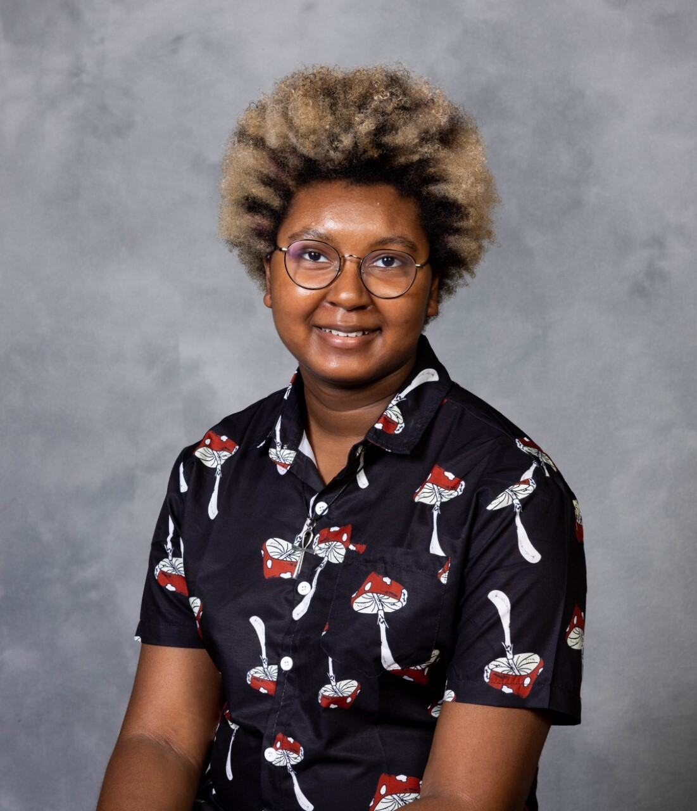
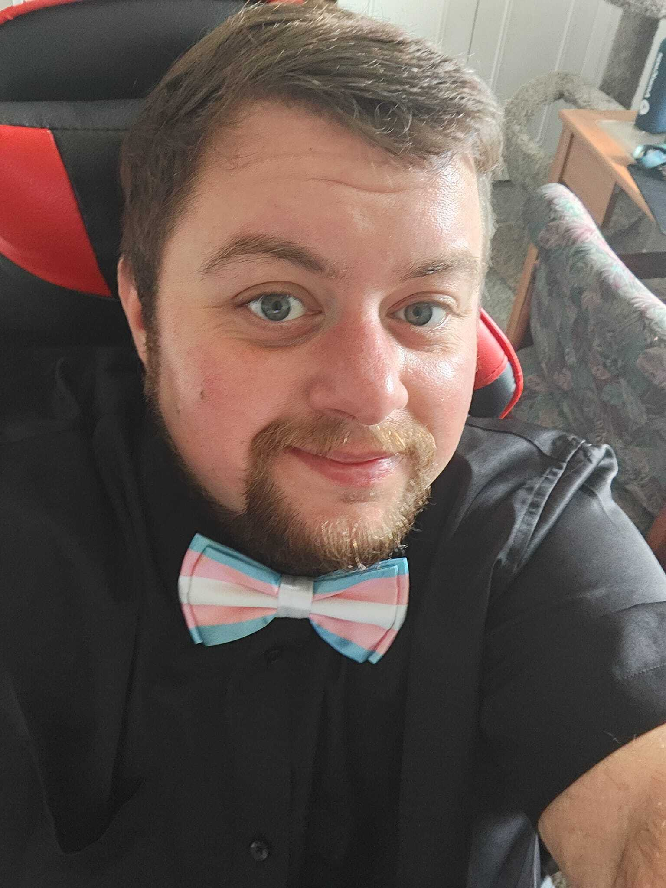
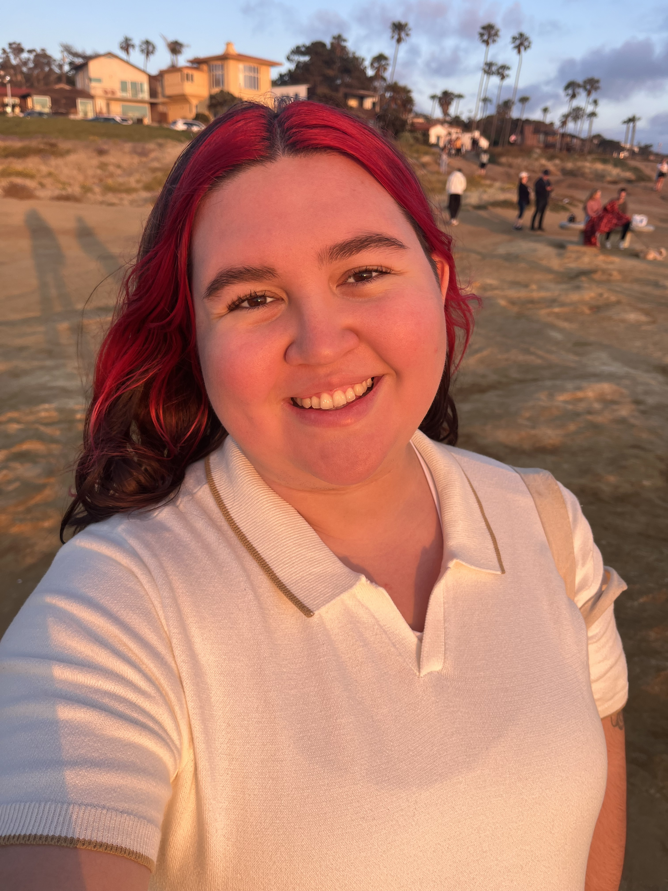
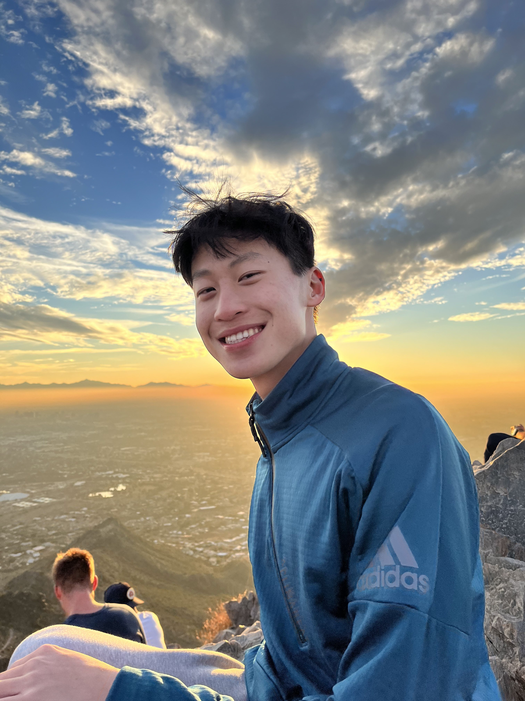

Thanks to a grant from Dow through the company’s All <i>IN</i> ERG fund\*, we are so deeply excited and honored to to announce our first paid RECRUIT Intern cohort and begin working with them this school year!

\*Dow's ALL <i>IN</i> ERG Fund is a grant program that empowers the Company's Employee Resource Groups to address local community diversity, inclusion, and equity needs. Read the full press release [here](https://thrivelifeline.org/recruit_grant.html).

RECRUIT interns are provided with one full year of in depth training and mentorship alongside skills practice in crisis response for marginalized communities, community education and outreach, and leadership of people with multiply marginalized identities. They will work with us for an average of 6 hours per week for 50 weeks, giving them the ability to manage other jobs, school, and caregiving activities that are common in multiply marginalized communities. Our remote internship with flexible hours supports students facing a variety of barriers to paid opportunities. Our RECRUIT cohort will be with us from August 2023 - August 2024, and we couldn't be more excited!

Learn about each of our RECRUIT interns, their professional goals and dreams, and their hobbies, below!

 

## Jordy (they/them):

Jordy Kazeze is a 21 year old college student near the Chicagoland area. They are studying psychology with a minor in business innovation & entrepreneurship and will be graduating with their bachelors degree this year! They’re excited to join the internship because they love working in places where they can help people; actively use their knowledge, skills, and abilities; and not feel like they have to compromise their many marginalized identities. In their free time, they love playing with animals, watching their favorite YouTube creators, anime, and cartoons, reading comics and manga, and being around other people. They can’t wait to join the THRIVE RECRUIT team and meet other like-minded individuals with similar experiences while working on a mission they believe in!

 

## Liam (he/him)

Liam Lyn Wolf is a trans man, disabled, and a neurodivergent individual. Liam is a Certified Community Health Worker and a Bachelor of Science Student majoring in Community Health Education at Southern New Hampshire University. He currently resides in Detroit, Michigan, with his partner, their two cats, and their Corgi puppy. Liam is dedicated to supporting the LGBTQ+ community and has a passion for advocacy and activism. He currently serves on the Planned Parenthood of Michigan Gender Affirming Care Advisory Board and volunteers for Transcend the Binary, a trans-led organization. In his free time, Liam enjoys playing guitar, playing with his pets, and reading. He is currently reading a book called “The Coming Plague” by Laurie Garrett and loves learning more about infectious diseases. Liam is honored to have been selected for the 2023-2024 THRIVE Intern Cohort and is excited about having the opportunity to intern in a totally remote position that supports marginalized communities.

 

## Ren (they/them):

Ren Zhang is a freshman at UC Berkeley. They plan on double majoring in political science and sociology, and hope to graduate in three years. As a nonbinary immigrant, they are a human rights activist and believe that intersectionality should be a huge priority. In the future, whether Ren works in law or with an NGO, they hope to use their knowledge and experiences from the THRIVE RECRUIT program to bring inclusion and empathy to their career and community. Outside of school and activism, their favorite hobbies are gardening, baking, and piano. They're an avid reader and enjoy thrifting second-hand books. They're very social and love meeting new people! Ren is super excited to work with THRIVE, and looks forward to being able to give back to their community.

 

## Emilio (they/them)

Emilio Valladolid is studying both Psychology and Sociology at San Diego State University. They do various intersectional work within their greater community including working with several nonprofits. Their passions include bridging inequities, such as disparities in sexual reproductive health, LGBTQ+ education, racial and disability justice and dismantling systems of oppression. They believe their lived experience as an individual within these marginalized communities helps them bring a valuable perspective to the table, while their passion to create safe, accessible, and inclusive support for all, drives their dedication to advocacy. Emilio’s favorite way to spend their time other than advocacy work, is with their sweet girlfriend Monique, their silly dog Simba, and their suave cat Smokey. They love spending time in any body of water and learning new facts about sharks and other marine life. They hope to spend their life always growing and discovering something beautiful everyday.

 

## Geoffrey (he/him):

Geoffrey Xue is a rising junior at The Ohio State University, majoring in Psychology with a minor in Studio Art. Geoffrey is also on the pre-med track, with the hopes of being a psychiatrist one day. Aside from his academic studies, Geoffrey is passionate about promoting healthcare access to local Columbus residents in need by leading an LGBTQ+ friendly clinic called The Rainbow Clinic, and volunteering at the Columbus Cancer Clinic. Likewise, he is dedicated to recruiting and supporting the retention of minority students at his university, representing The Office of Diversity and Inclusion Undergraduate Recruitment Society as an executive board member and engaging in a program called PASS as a Peer Leader Advisor to support first-year underrepresented students in their transition to college. Geoffrey is excited to work as a RECRUIT Intern for the THRIVE Lifeline to take part in meaningful work and advocate for the mental health support of STEMM students.

