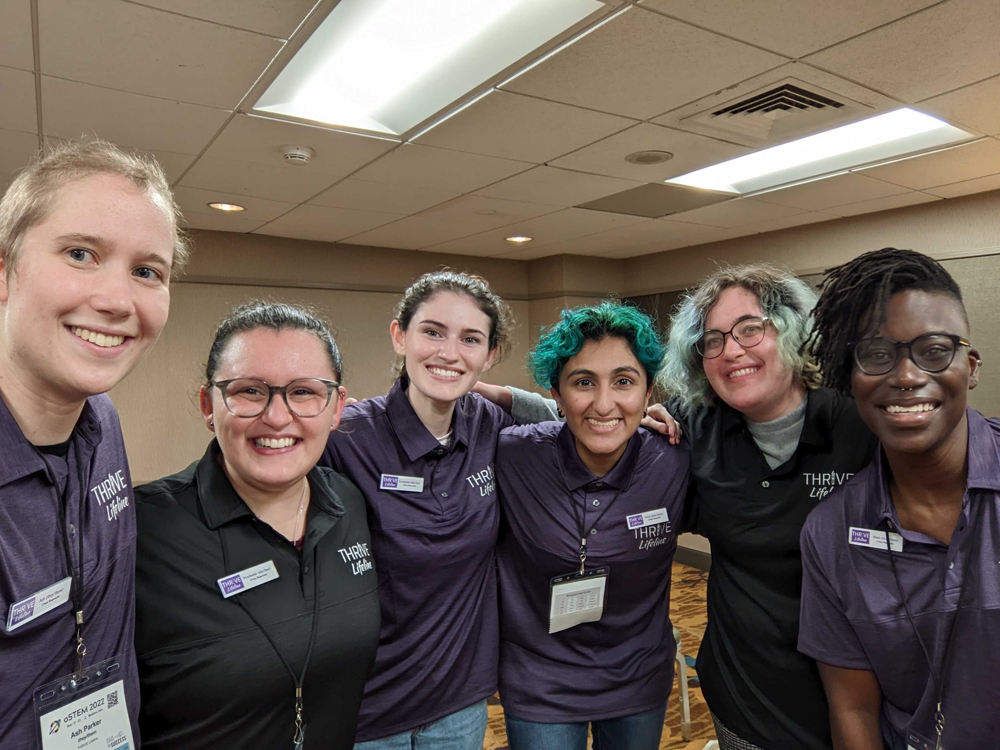

11 March 2023

 - THRIVE Lifeline recently received a grant from Dow through the Company’s ALL <i>IN</i> ERG Fund. 
 
 - Thanks to this grant, THRIVE can provide stipends to five undergraduate interns and one internship coordinator for the RECRUIT Internship.
 
  
 
## Project Information
 
Pembroke Pines, FL - Executives at THRIVE Lifeline have announced receiving a grant from Dow, through the Company’s ALL <i>IN</i> ERG Fund for the 2023 - 2024 THRIVE RECRUIT Internship. This internship has provided training and applied skills development to 20 volunteer-based interns inside an identity-affirming and trauma-informed community since Fall 2020. Former RECRUITs share: “My internship has made me much more confident that I could succeed in my dream career of being a therapist” and “I felt truly seen and supported. Everything was so accessible, and I was encouraged to thrive as myself and have my own needs met.” THRIVE is truly grateful for the growth of this internship and the ability to offer internship stipends through the generosity of this grant.

“As an organization made by and for people with marginalized identities, we deeply value being able to give paid opportunities to students and help them to thrive personally, academically, and professionally. This grant is a dream come true,” said Ryder Fox (they / them), President and Founder of THRIVE.

 

 Dow’s ALL <i>IN</i> ERG Fund is a grant program that empowers the Company’s Employee Resource Groups to address local community diversity, inclusion and equity needs.

 

## About THRIVE Lifeline

THRIVE Lifeline’s mission is to end stigma for people with marginalized identities and close gaps in access to crisis intervention, validation, and resources through whole-human support. THRIVE is available for confidential and non-judgmental support 24/7/365 and has provided support to texters in all U.S. states and territories since its founding in June 2020. In addition to lifeline services, THRIVE provides the RECRUIT Internship program, workforce development training, crisis management and crisis response services, and a variety of community education and outreach.
