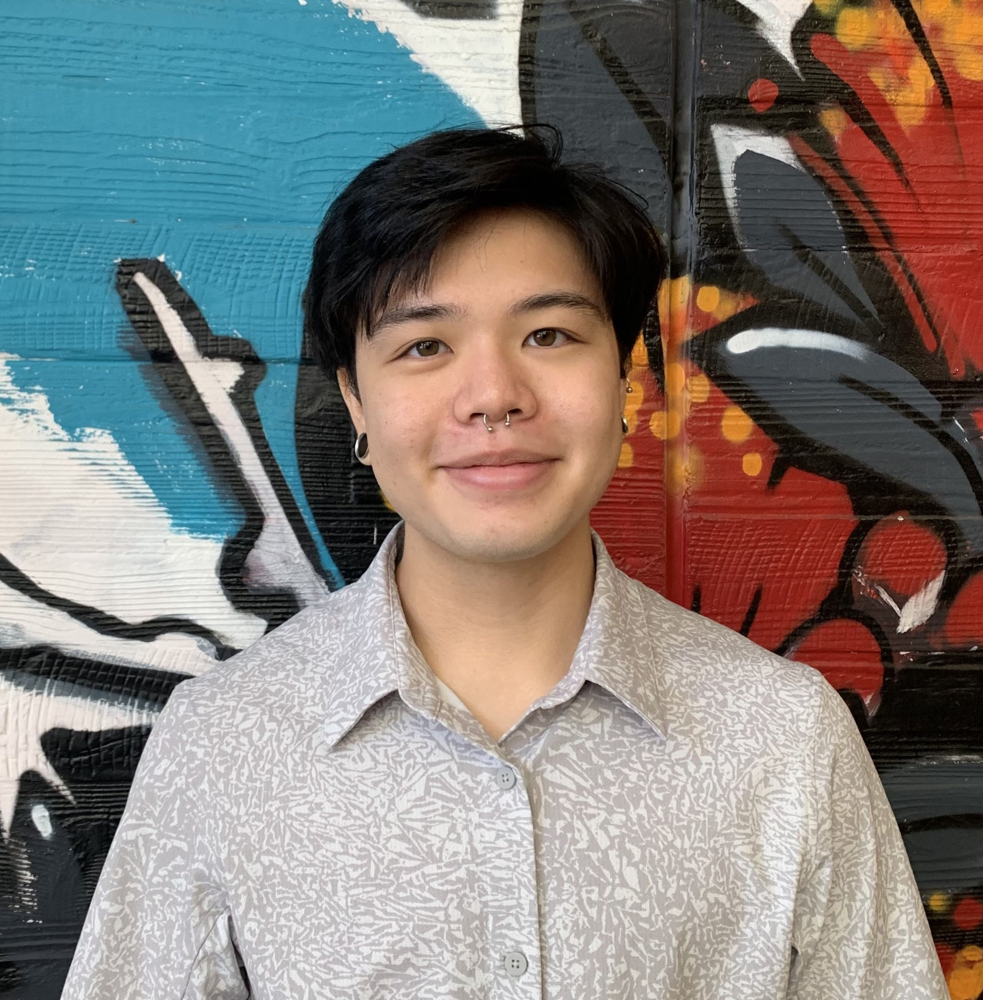
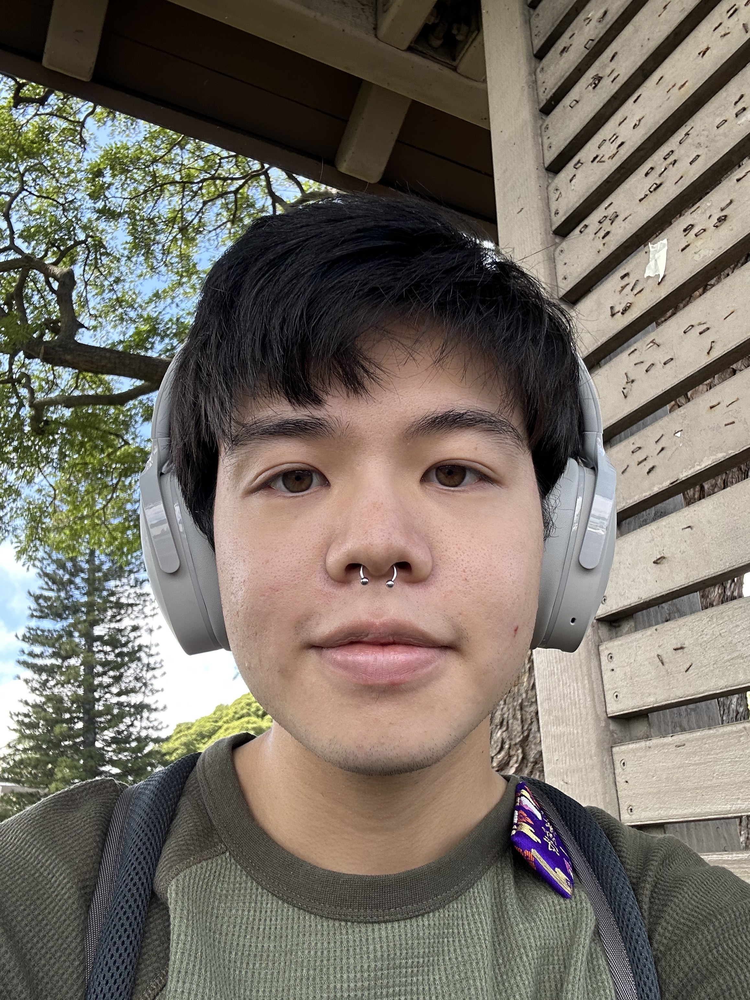

 

## Quinn (he/him): Current RECRUIT Intern

<b>Why does the RECRUIT internship matter to you?</b>

"It's been difficult to find ways to get practical experience in college since COVID-19 started. The RECRUIT internship matters to me because it gave me a way to get involved and get experience in a field that doesn't have a lot of undergraduate opportunities. The RECRUIT internship has also introduced me to such a wonderful and supportive community that I'm grateful to be a part of. Everyone on the team brings valuable and diverse sets of knowledge that make us stronger."

<b>What made you want to apply for the RECRUIT internship?</b>

"I was ecstatic to hear about the opportunity to be involved with THRIVE.  It was truly a no-brainer for me to apply for the RECRUIT internship. I've had my fair share of negative experiences with crisis lines in the past. A lot of the lines that I've reached out to were ill-equipped to support my trans identity and I felt that I couldn't share about everything that I was going through in fear that they would call emergency services on me. One of the main reasons that I decided to apply for the RECRUIT internship with THRIVE was because of the no-escalation policy. Another reason that I decided to apply was that THRIVE truly values and demonstrates that they support diversity and inclusion."

<b>Why would you suggest someone else apply for the RECRUIT internship?</b>

"I've been involved with a lot of volunteer and extracurricular work during my college career. These experiences have provided me with numerous skills that have helped me excel in other areas of my life. However, my RECRUIT internship at THRIVE has given me, by far, the most rewarding experiences that I ever could have asked for. I feel immensely fulfilled knowing that I am contributing to giving back to my community and creating a better world for people to live in. I've also gained leadership, communication, teamwork, and empathy-building skills through the RECRUIT internship."

<b>What is the biggest thing you have learned / biggest way you have been impacted from the internship?</b>

"Being LGBTQ+ and a college student in the midst of COVID-19 has been a very isolating experience. But my internship at THRIVE has shown me that we are never truly alone in this world. I cannot understate the amount of support that I have gotten since I started my internship. I have felt supported at every step of the way. My mentor has been a truly inspirational figure in my life and I'm so grateful for the other leaders at THRIVE who have guided me through tough moments. It's really rewarding to know that you're molding a space where others don't have to fight as hard to stay alive and feel respected."

 

## Morgan (she/her): Current RECRUIT Intern

<b>Why does the RECRUIT internship matter to you?</b>

"The RECRUIT internship from THRIVE has given me a valuable opportunity to serve others as a crisis-responder, and has provided me with a unique perspective on day-to-day life. THRIVE matters to me because I am constantly inspired by its community and overall mission to support, value, and uplift others."

<b>What made you want to apply for the RECRUIT internship?</b>

"I was not initially considering an internship this year, but when the opportunity to intern with THRIVE was introduced to me, I knew I had to apply. My main consideration in applying for THRIVE was my interest in a chance to support groups I can identify with."

<b>Why would you suggest someone else apply for the RECRUIT internship?</b>

"I would suggest someone apply for the RECRUIT internship because it allows one to grow as an individual, learn to view diverse challenges and obstacles in a unique way, and most of all, you will create valuable and lasting connections with the other wonderful members of THRIVE."

<b>What is the biggest thing you have learned / biggest way you have been impacted from the internship?</b>

"The techniques and skills I was taught by THRIVE have definitely been an impactful part of my experience from the RECRUIT internship. The skills learned through THRIVE’s training are effective in real-life scenarios, and can be useful for all."

