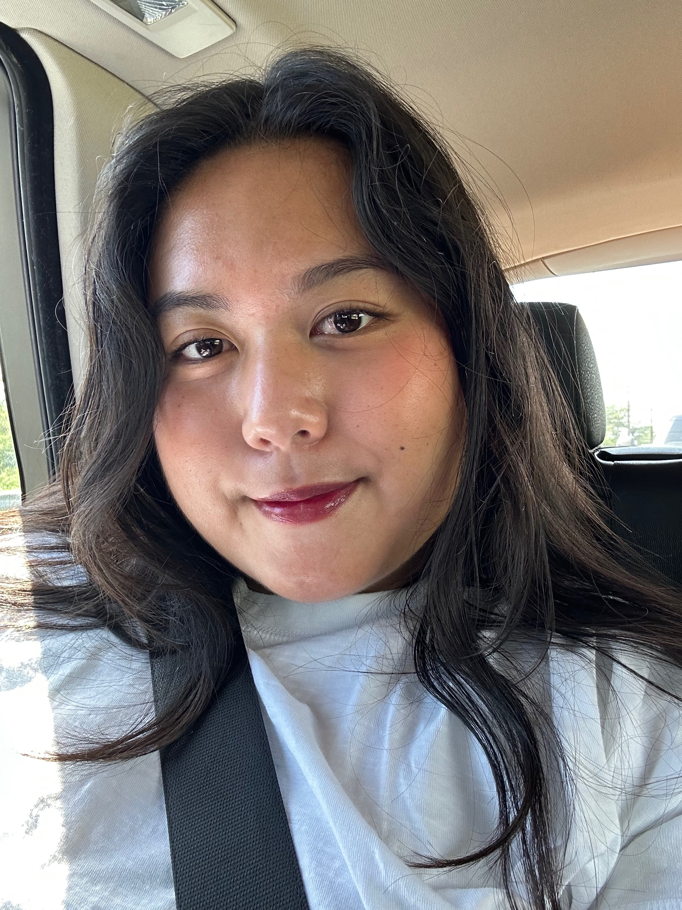
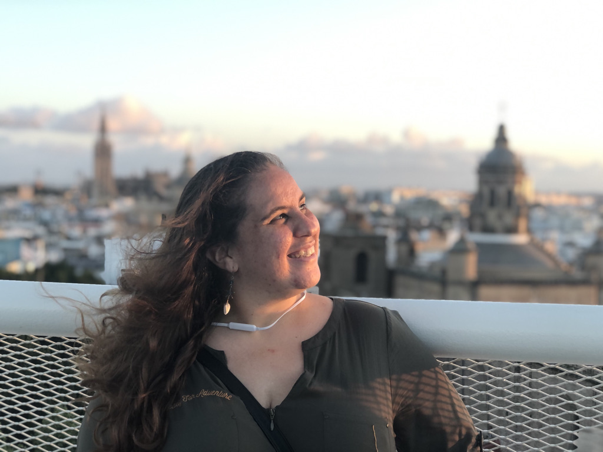

Since Fall 2020, THRIVE has proudly supported 20 volunteer-based interns, providing high quality crisis response training and personalized mentorship inside a team of people who affirm them. As people with intersecting marginalized identities, we personally understand the barriers that our interns face to gaining professional experience and being humanized in their workplaces or academic environments. We're so proud of the ways that the THRIVE RECRUIT Internship program has evolved since we first began! Don't just take our word for it, though. Read below to learn what our RECRUITs share about their experiences.

 

## Quinn (he/him): 2022 Cohort

<b>What has being a RECRUIT meant to you?</b>

It's been difficult to find ways to get practical experience in college since COVID-19 started. The RECRUIT internship matters to me because it gave me a way to get involved and get experience in a field that doesn't have a lot of undergraduate opportunities. The RECRUIT internship has also introduced me to such a wonderful and supportive community that I'm grateful to be a part of. Everyone on the team brings valuable and diverse sets of knowledge that make us stronger.

<b>Why did you choose the RECRUIT Internship?</b>

I was ecstatic to hear about the opportunity to be involved with THRIVE.  It was truly a no-brainer for me to apply for the RECRUIT internship. I've had my fair share of negative experiences with crisis lines in the past. A lot of the lines that I've reached out to were ill-equipped to support my trans identity and I felt that I couldn't share about everything that I was going through in fear that they would call emergency services on me. One of the main reasons that I decided to apply for the RECRUIT internship with THRIVE was because of the no-escalation policy. Another reason that I decided to apply was that THRIVE truly values and demonstrates that they support diversity and inclusion.

<b>What would you tell potential RECRUIT applicants?</b>

I've been involved with a lot of volunteer and extracurricular work during my college career. These experiences have provided me with numerous skills that have helped me excel in other areas of my life. However, my RECRUIT internship at THRIVE has given me, by far, the most rewarding experiences that I ever could have asked for. I feel immensely fulfilled knowing that I am contributing to giving back to my community and creating a better world for people to live in. I've also gained leadership, communication, teamwork, and empathy-building skills through the RECRUIT internship.

<b>What is your biggest takeaway as a RECRUIT?</b>

Being LGBTQ+ and a college student in the midst of COVID-19 has been a very isolating experience. But my internship at THRIVE has shown me that we are never truly alone in this world. I cannot understate the amount of support that I have gotten since I started my internship. I have felt supported at every step of the way. My mentor has been a truly inspirational figure in my life and I'm so grateful for the other leaders at THRIVE who have guided me through tough moments. It's really rewarding to know that you're molding a space where others don't have to fight as hard to stay alive and feel respected.

 

## Morgan (she/her): 2022 Cohort

<b>What has being a RECRUIT meant to you?</b>

The RECRUIT internship from THRIVE has given me a valuable opportunity to serve others as a crisis responder, and has provided me with a unique perspective on day-to-day life. THRIVE matters to me because I am constantly inspired by its community and overall mission to support, value, and uplift others.

<b>Why did you choose the RECRUIT Internship?</b>

I was not initially considering an internship this year, but when the opportunity to intern with THRIVE was introduced to me, I knew I had to apply. My main consideration in applying for THRIVE was my interest in a chance to support groups I can identify with.

<b>What would you tell potential RECRUIT applicants?</b>

I would suggest someone apply for the RECRUIT internship because it allows one to grow as an individual, learn to view diverse challenges and obstacles in a unique way, and most of all, you will create valuable and lasting connections with the other wonderful members of THRIVE.

<b>What is your biggest takeaway as a RECRUIT?</b>

The techniques and skills I was taught by THRIVE have definitely been an impactful part of my experience from the RECRUIT internship. The skills learned through THRIVE’s training are effective in real-life scenarios, and can be useful for all.

 

## Eun (they/them): 2022 Cohort
<b>What has being a RECRUIT meant to you?</b>

The RECRUIT internship is important to me as a psychology major in college and as an opportunity to help others in ways I searched for and failed to find in my own times of need in the past.

<b>Why did you choose the RECRUIT Internship?</b>

The internship offered experience with working in the field of mental health, and with THRIVE's large focus on marginalized folks, I found myself wanting to apply.

<b>What would you tell potential RECRUIT applicants?</b>

The people at THRIVE are incredibly supportive, understanding, and provides meticulous training that makes you feel ready as a crisis responder. If you want to help marginalized people in crisis or just in need of a listening ear and are perhaps marginalized yourself, there is great reward and personal growth in joining and working in the RECRUIT internship.

<b>What is your biggest takeaway as a RECRUIT?</b>

I learned so much more about marginalized experiences through this internship, better ways to navigate trauma, ways to ground people that have proven to help others in real life, and so many more. I've also learned time management, timeliness, and ways to communicate efficiently in a team-focused environment.

 

## Leslie (she/her): 2021 Cohort

<b>What has being a RECRUIT meant to you?</b>

The THRIVE Lifeline RECRUIT internship is a valuable experience for me because it allowed me to develop a good foundation for my future endeavors. As a counseling student, I often found myself referring back to what I learned in RECRUIT training and applying it to my philosophy as a future counselor. I also feel that my experience at THRIVE Lifeline is very fulfilling because it’s important to extend compassion towards others during these difficult times and being a RECRUIT has allowed me to do that.

<b>Why did you choose the RECRUIT Internship?</b>

I applied to the RECRUIT internship because I really resonated with THRIVE Lifeline’s cause. As a POC and a member of the LGBTQ+ community, it is imperative to address the struggles that others in our community are facing and to give them a safe space. Mental health advocacy is also something that I highly value, and I really liked that THRIVE Lifeline prioritizes the mental health of texters and their crisis responders.

<b>What would you tell potential RECRUIT applicants?</b>

I highly recommend others to apply for the RECRUIT internship. Being a crisis responder allows you to give back to your community, which is so rewarding. Being a RECRUIT also allows individuals to learn about ways in which we can be supportive and empathetic towards texters and the people in our own lives. In addition to the valuable skills that individuals may obtain through training, the THRIVE Lifeline community is so welcoming and kind.

<b>What is your biggest takeaway as a RECRUIT?</b>

One of the biggest things I’ve learned is that to be a part of a good support system, the greatest thing we can do is be good listeners. As crisis responders, we may feel obligated to solve other people’s problems or give advice. But sometimes we just need to be present and listen to our texters.

 

## Leinani (they/she): 2021 Cohort

<b>What has being a RECRUIT meant to you?</b>

I've learned to address my own biases and be exposed to many diverse individuals. My knowledge gained from training to help these individuals and connect with them on our shared common ground allows me to support them no matter what they are going through. I've learned how to work with many different identities as well as a myriad of ways to support texters. Whether that be texters seeking support, validation, a safe-space, a non-judgmental listening ear, resources, or in imminent crisis.

<b>Why did you choose the RECRUIT Internship?</b>

Having been rejected by society, I wanted to find a safe space where I could be accepted as me and to create / hold that space for those who reach out to THRIVE. Some days we need someone to help us give ourselves permission to take up the space we deserve in this world--THRIVE does this!

<b>What is your biggest takeaway as a RECRUIT?</b>

Being connected to THRIVE's community and my mentor allows me to develop individually and professionally. I have gained confidence in myself, in my abilities, and as a leader. Academically, I've been able to gain exposure and experience supporting people through mental health crises while applying the knowledge I gained from my classes and THRIVE training. Professionally, I am able to gain experience as I prepare my grad school applications for obtaining my PsyD and helping serve underserved populations.
