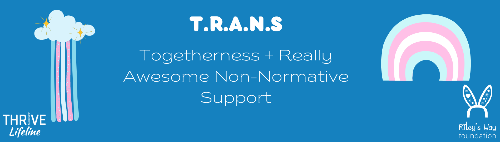

<!-- <i class="fas fa-hard-hat fa-3x" aria-hidden="true"></i> Under Construction! <i class="fas fa-hard-hat fa-3x" aria-hidden="true"></i> -->

 

A quarterly support group that specializes in helping people in STEMM who are 
Two-Spirit, Transgender, Agender, Genderqueer, Gender Nonconforming, 
Genderfluid, Nonbinary, Questioning, or otherwise exist outside of the gender 
binary or are a person of Trans experience (and welcomes all such people who 
need community, regardless of affiliation with a STEMM field). 

Age limit is 16 or older. Maximum capacity for each group is 100 people.

 

## Dates and Topics
All support group meetings are at 7pm Eastern Time Zone (New York).

- **Saturday August 6, 2022**
  - Topic: coming out and being out in school and the workplace.
  - Registration is now closed.
- **Saturday November 5, 2022**
  - Topic: navigating relationships and dating.
  - Registration is now closed.
- **Saturday February 4, 2023**
  - Topic: dealing with friends and family.
  - Link to register: [https://thriv.life/trans](https://www.eventbrite.com/e/trans-togetherness-really-awesome-non-normative-support-meeting-3-tickets-460566917047)
- **Saturday May 6, 2023**
  - Topic: managing dysphoria.
  - Link to register will be posted after the third support group meeting.

 

Free wellness gift for the first 50 attendees! Register today to get your free 
TRANS affirmation cards (limit 1 per person): [https://thriv.life/trans](https://www.eventbrite.com/e/trans-togetherness-really-awesome-non-normative-support-meeting-3-tickets-460566917047)

  

## What to Expect
A place where you can THRIVE! Come as you are and have a candid conversation 
with others who share your identities and experiences. 
You'll be with people who are just people, like you. 
Our groups are facilitated by trained crisis responders who identify as Trans 
and Nonbinary and personally understand gaps in affirming mental health 
resources, community, and relevant resources. 
We don't have or offer answers; only listen and support. 
Whoever you are, wherever you are, we're here for you.

 

The general support group structure will be:

- **Welcome:** Get comfortable in our space, and go over our community 
  guidelines.
- **Introductions:** Who we are, what THRIVE is, what this support group is 
  about.
- **Discussions:** Each group has a theme with facilitated topics and 
  questions. 
  We'll give you the space to discuss these in small groups with facilitators.
- **Wrap-Up:** We'll introduce TRANS affirmation cards and discuss future 
  support groups and ways to stay connected. 

 

Funding for 2022-2023 TRANS support group meetings was made possible through 
the generous gift of the [Riley's Way Foundation](https://rileysway.org/)
through their Call for Kindness Fellowship.
