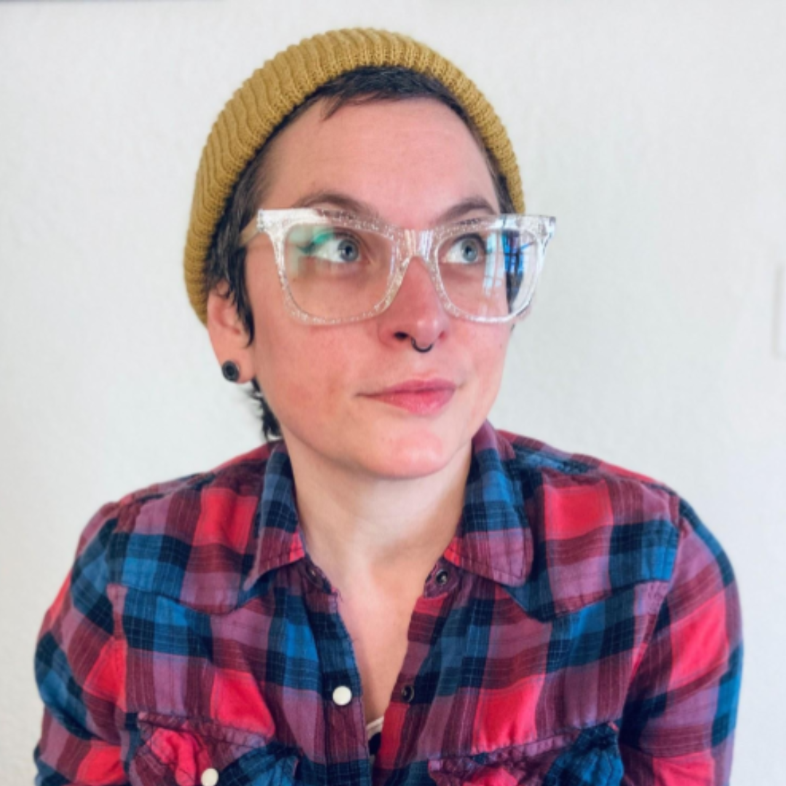

<!-- <i class="fas fa-hard-hat fa-3x" aria-hidden="true"></i> Under Construction! <i class="fas fa-hard-hat fa-3x" aria-hidden="true"></i> -->

 

THRIVE Lifeline and Stronger U are partnering to provide the following workshop series this spring! These workshops will help you to destigmatize dissociation and suicidality, and to show up for one another as a community of peers in safe, affirming, and consensual ways.

<a href="https://www.jotform.com/240434317697158/" class="btn btn-primary btn-lg" role="button">Register for Workshops</a>

 

# Spring Series #1: People, Not Just Parts

Our [sliding scale](https://strongeruwellness.com/services/workshops/#Pricing) for this series is between \$40 – \$85 for each workshop. We offer a 10% discount to those who purchase the entire series. We will have a limited number of scholarships available. If you do need a scholarship, please email <info@strongeruwellness.com>.

Speaker Bio: kitty lu bear

kitty lu bear is a white, disabled, queer, non-binary femme. Collectively, they are Mad and multiple, recognizing that their experience of ‘many in one body’ as a multidimensional state is the lens through which they experience the world. They are deeply connected to supporting interdependent solutions around healing justice and accessibility for the LGBTQIA+ community. From facilitating writing workshops to holding space in peer-led support groups, they are interested in the symbiotic nature of community care. They graduated from UMN-Twin Cities where they received an interdisciplinary BS in Engineering Studies, Holistic Health and Healing, and Plant/Fungal Biology.

 

Workshop 1: Undoing the Pathology of Dissociative Experiences

Many times therapeutic spaces refer to the ‘parts’ of self, as parts of one single whole person. This approach can reinforce the premise that a ‘singular self’ experience is the only one possible, and more so, the only one desired. This workshop will dive into the lived aspects of multiplicity/plurality, from a Mad lens. We will illuminate the process of depathologizing dissociative experiences and healing systemic psychiatric consequences. Madness acts not only as a lens but as a praxis to deconstruct the diagnosis of our lived experience and ground it in naturally occurring non-singular experiences of our world around us.

<b>Date:</b> Sunday, March 31 at 8pm GMT / 4pm ET / 10am HT; 90 minutes

 

Workshop 2: Redefining Peer Support for Dissociative Experiences

The work of redefining peer support spaces first invites a deconstruction of the self in the experience of survival, safety, and healing. How do we show up in support when the “self” is a communal experience, one not bound by linearity, memory, or time. This workshop will explore the lived experience of both sides of peer support, from reaching out in crisis in multiplicity/plurality to showing up in multiplicity/plurality as a lens for peer support. We will understand together that redefining peer support for non-singular experiences is a collective resistance to pathology.

<b>Date:</b> Sunday, April 7 at 8pm GMT / 4pm ET / 10am HT; 90 minutes

 

[Click here to register for workshops](https://www.jotform.com/240434317697158/).

 

 

# Spring Series #2: Showing Up in Ways That Count 

Presented by THRIVE Lifeline and Stronger U teams

Our [sliding scale](https://strongeruwellness.com/services/workshops/#Pricing) for this series is between \$62 – \$135 for each workshop. We offer a 10% discount to those who purchase the entire series. We will have a limited number of scholarships available. If you do need a scholarship, please email <info@strongeruwellness.com>.

 

Workshop 1: Creating Mental Health Safe Spaces

Whether you’re an organizational or community leader, a friend or loved one, or holding space internally, showing up during mental health struggles is an intentional practice. In this workshop, we will begin to destigmatize suicidality by identifying what “safe” specifically means to your group, clarifying what scope of support that you can offer, vetting relevant resources, and responding appropriately when you learn that a group member is struggling with thoughts of suicide, urges to harm, or traumatic experiences.

<b>Date:</b> Sunday, May 5 at 7pm GMT / 3pm ET / 9am HT; 3 hours

 

Workshop 2: Creating Suicide Safe Conversations

In this workshop, you will learn how to hold a sacred space for other marginalized people when they need to talk about their suicidality. Examine your own fears, understand what will shut someone down, and practice having consensual and affirming conversations about suicide.

<b>Date:</b> Sunday, May 19 at 7pm GMT / 3pm ET / 9am HT; 3 hours

 

[Click here to register for workshops](https://www.jotform.com/240434317697158/).

