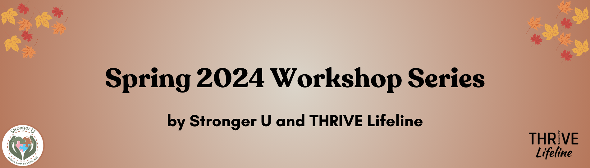

<!-- <i class="fas fa-hard-hat fa-3x" aria-hidden="true"></i> Under Construction! <i class="fas fa-hard-hat fa-3x" aria-hidden="true"></i> -->

 

THRIVE Lifeline and Stronger U are partnering to provide the following workshop series! These workshops will help you to destigmatize experiences within multiply marginalized communities, and uplift lived experience.

<a href="https://form.jotform.com/240434317697158" class="btn btn-primary btn-lg" role="button">Register for Workshops</a>

 

# Summer Series #1: Disabled Realities

Our [sliding scale](https://strongeruwellness.com/services/workshops/#Pricing) for this series is between \$50 – \$110 for each workshop. We offer a 10% discount to those who purchase the entire series. We will have a limited number of scholarships available. If you do need a scholarship, please email <info@strongeruwellness.com>.

Speaker Bio: Regina

Regina (they/them) is a Nonbinary, Queer, Disabled, Neurodivergent, white person who has been a disabled activist for over 6 years. They believe in unraveling theories and frameworks of disability where they align most with the social model of disability, and prioritize lived experiences over clinical opinions. This translates into community care and organizing, boots-on-the-ground activism, and creating resource webs. In their work—including writing university legislation, fighting for and serving in accessibility positions, and creating events with people including the late Judy Heumann—Regina prioritizes care, action, and community. They have a degree in Kinesiology from Cal Poly and minored in Dance and Queer Ethnic Studies, which shapes their intersectionality approach.

 

Workshop 1: We need your help, but we don’t need saviors

An exploration of how saviorism harms the disability community and how to help meaningfully. We will discuss the social, medical, and other models of disability and how framing affects the outcome felt by disabled people. The focus will be on how our rights, opportunities, and laws are shaped by perceptions of disability, and by the efforts of pre-disabled saviors and white saviorism. Alternative solutions will be explored, focusing on pre-disabled people fixing the problems they create, instead of fixing us. Finally, there will be space for creativity and reflection on actions pre-disabled people can take instead of engaging in saviorism. 

<b>Date:</b> Sunday, July 14 at 8pm GMT / 4pm ET / 10am HT; 2 hours 

 

Workshop 2: Crip Rage

An exploration into the systematic and personal barriers that disabled people face and how we continue to resist through peace and rage. We discuss how our community comes together despite the barriers and violence we face, highlighting the Crip movement. Rage against injustice is common in the disability community, we are justified in our anger and must navigate the cognitive dissonance of living in a world that is actively trying to push us out. Advice for practitioners on avoiding tone policing and addressing anger without repressing it will be shared, along with how to encourage feeling and expressing rage with the wide range of emotions we experience. 

<b>Date:</b> Sunday, July 21 at 8pm GMT / 4pm ET / 10am HT; 2 hours

[Click here to register for workshops](https://form.jotform.com/240434317697158).

 

# Past Workshops
- People, Not Just Parts: Undoing the Pathology of Dissociative Experiences (speaker: kitty lu bear). [Click here to buy workshop recording](https://strongeruwellness.com/product/people-not-just-parts-undoing-the-pathology-of-dissociative-experiences/)
- People, Not Just Parts: Redefining Peer Support for Dissociative Experiences (speaker: kitty lu bear). [Click here to buy workshop recording](https://strongeruwellness.com/product/recording-of-people-not-just-parts-redefining-peer-support-for-dissociative-experiences/)
- Showing Up in Ways That Count: Creating Mental Health Safe Spaces (speakers: THRIVE Lifeline and Stronger U teams). [Click here to buy full course workbook](https://strongeruwellness.com/product/full-course-workbook-for-creating-mental-health-safe-spaces/)
- Showing Up in Ways That Count: Creating Suicide Safe Conversations (speakers: THRIVE Lifeline and Stronger U teams). [Click here to buy full course workbook](https://strongeruwellness.com/product/full-course-workbook-for-creating-suicide-safe-conversations/)

